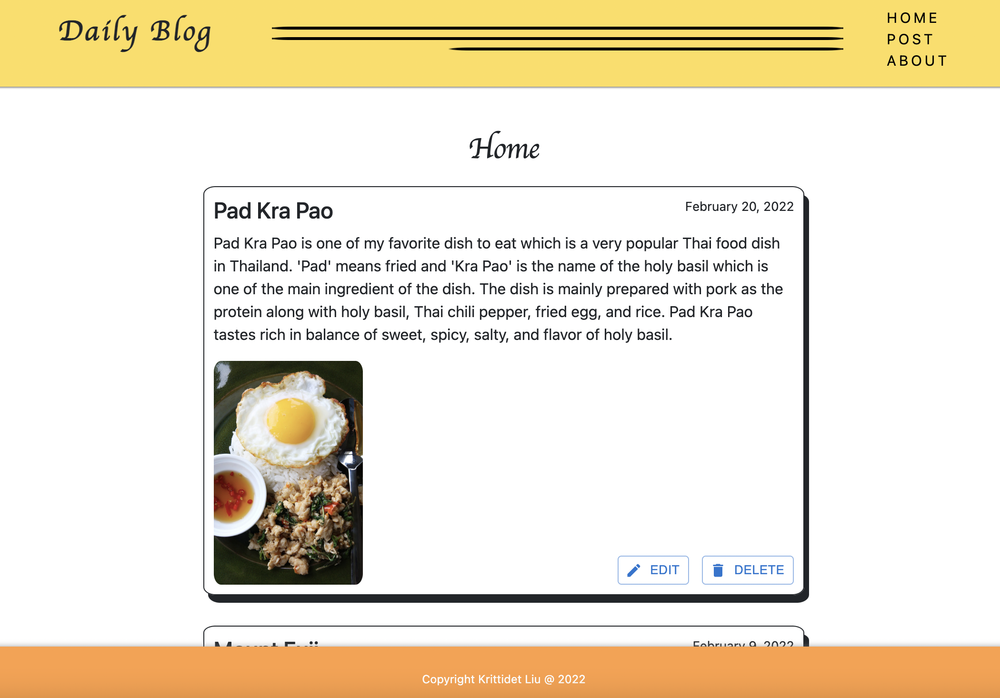
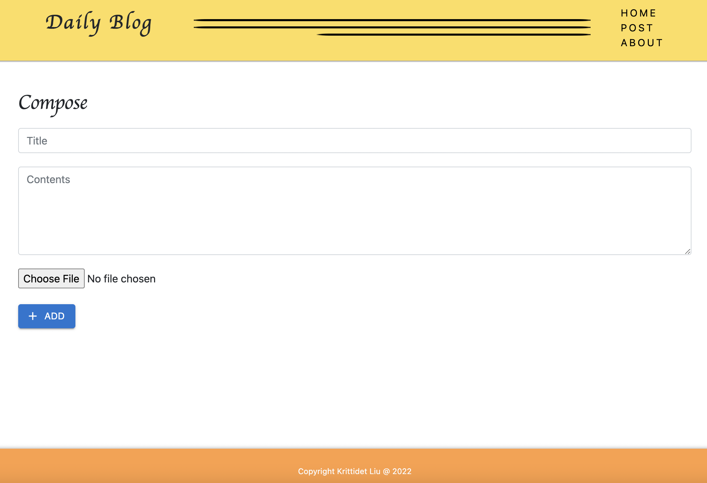
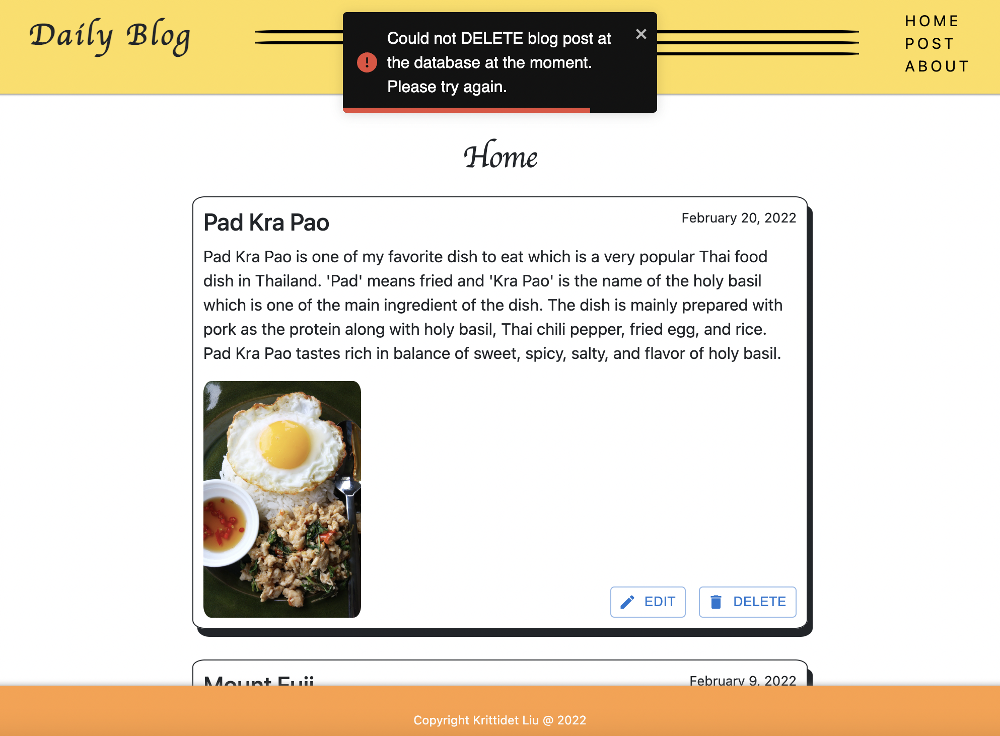

# Blog-React

This is a blog Web Application project. The website is built using a MERN stack which includes the use of React framework, JavaScript, Node, MongoDB Atlas, as well as, HTML and CSS. React API tools used includes browser router, link, useNavigate, useLocation, useEffect, and other hooks. Implemented all CRUD operations on the database. 

Website Link (Project is deployed onto Heroku) --> https://react-weather-web-application.herokuapp.com

If running the project locally, make sure to install all npm dependencies by running command --> npm install 

**Sample Website**

*Home page rendering all blog posts from MongoDB Atlas database*

*Compose page for adding new blog post*

*Showing Toast Error(s) when there are issues or problems with CRUD operations*